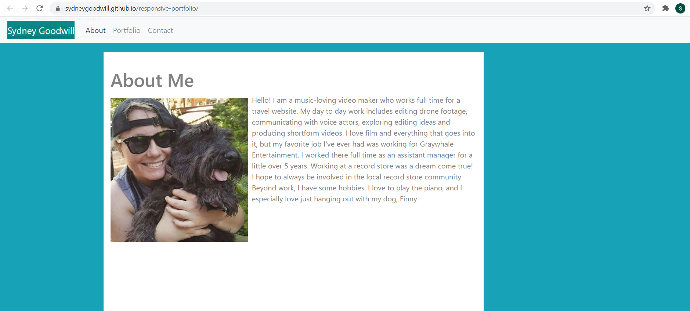

# responsive-portfolio

Link to the live site: [Responsive Portfolio](https://sydneygoodwill.github.io/responsive-portfolio/)

# Purpose

The purpose of this repository is to display my portfolio in a mobile-responsive website. Using CSS and Bootstrap I was able to put together an About, Portfolio, and Contact page.

# Screenshot

# URL

https://github.com/SydneyGoodwill/responsive-portfolio